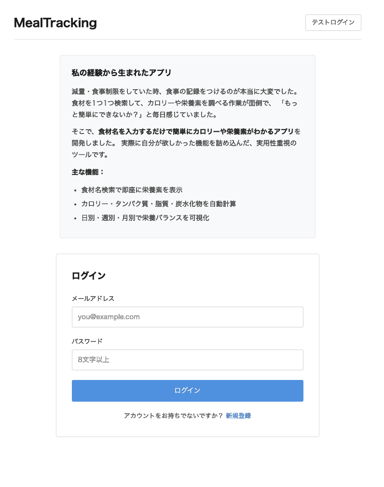
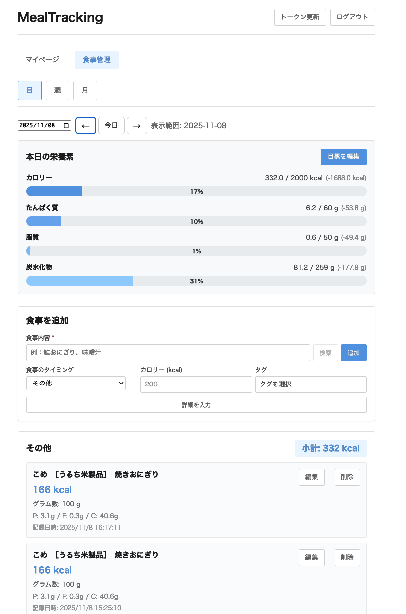
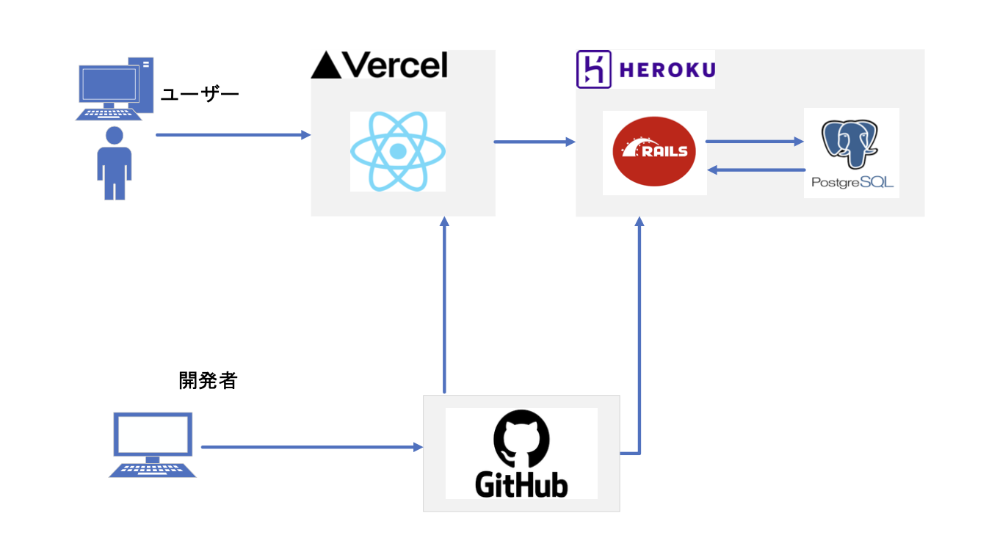
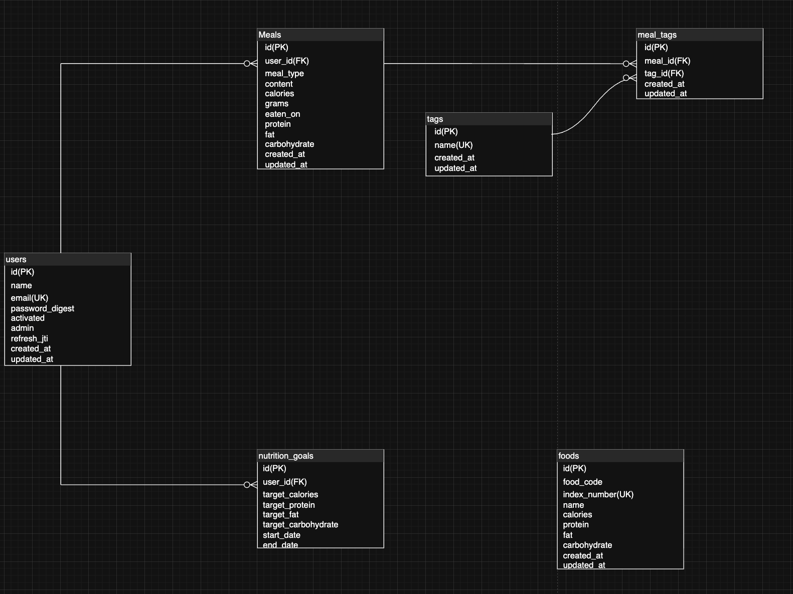

# 食事管理アプリケーション

本アプリは JWT 認証を実装した、栄養管理機能を持つフルスタック Web アプリケーションです。ユーザーは日々の食事を記録し、栄養摂取量を追跡し、目標に対する進捗を確認できます。



## デモ

- **フロントエンド**: https://jwt-meal-tracking.vercel.app/login
- **バックエンド API**: https://jwt-backend-api-5baa9f62386d.herokuapp.com/
- ※ API 専用。ブラウザで直接アクセスすると 404 が表示されます。

**テストアカウント**:

- 画面右上のテストログインから 1 ボタンでログイン可能です。
- メールアドレス: `test@example.com`
- パスワード: `password`

## プロジェクト概要

日々の食事記録と栄養管理を効率的に行うための Web アプリケーションです。セキュアな JWT 認証システムと、自動トークンリフレッシュ機能により、シームレスなユーザー体験を提供します。

**開発の目的**:

- セキュアな認証フローの実装経験を示す
- モダンなフルスタック開発技術のスキルを実証する
- 実用的なアプリケーション設計と実装能力をアピールする

## 主な機能

### 認証機能

- JWT（Access Token / Refresh Token）によるデュアルトークン認証
- 自動トークンリフレッシュ（有効期限 30 秒前に更新）
- JTI（JWT ID）を用いたサーバー側トークン無効化
- クロスタブ同期（複数タブでのログアウト連携）

### 食事・栄養管理機能

- 食事の記録（CRUD 操作）と食事タイプ分類（朝食・昼食・夕食・間食・その他）
- 日本食品成分表データベースからの食品検索（2000 件以上）
- 栄養素の自動計算（カロリー・タンパク質・脂質・炭水化物）
- 目標栄養素の設定と進捗の可視化
- 日次・週次・月次の表示切替とカレンダーナビゲーション

## 技術スタック

| カテゴリ           | 技術                                                                     |
| ------------------ | ------------------------------------------------------------------------ |
| **フロントエンド** | React 19.1.1, TypeScript 5.8.4, Vite 7.1.7, React Router DOM 7.9.4       |
| **バックエンド**   | Ruby on Rails 8.0.2 (API mode), Ruby 3.3.9, PostgreSQL 16                |
| **認証**           | JWT 3.1, BCrypt 3.1                                                      |
| **インフラ**       | Docker Compose（開発）, Heroku（バックエンド）, Vercel（フロントエンド） |
| **テスト**         | Vitest 3.1.1, Testing Library 16.3.0, Minitest（Rails）                  |

## アーキテクチャ

### システム構成図



### プロジェクト構造

```
JWTFullStack/
├── JWTbackend/              # Rails APIバックエンド
│   ├── app/
│   │   ├── controllers/api/v1/  # 認証・食事・ユーザー管理
│   │   ├── models/              # User, Meal, Tag, Food, NutritionGoal
│   │   └── services/user_auth/  # JWT生成・検証サービス
│   ├── config/
│   │   └── initializers/        # JWT設定・CORS設定
│   └── db/
│       ├── migrate/             # マイグレーション
│       └── seeds.rb             # 食品マスターデータ
│
├── JWTfrontend/             # Reactフロントエンド
│   └── src/
│       ├── components/      # 認証・食事・ユーザー設定コンポーネント
│       ├── hooks/           # useMealData（カスタムフック）
│       ├── api.ts           # APIクライアント（自動リフレッシュ機能）
│       ├── auth.ts          # 認証ユーティリティ
│       └── types.ts         # TypeScript型定義
│
└── docker-compose.yml       # 開発環境設定
```

### データベース設計（主要テーブル）



## 開発の工夫点

### 1. 自動トークンリフレッシュによるシームレスな認証

**課題**: Access Token の有効期限が切れると 401 エラーが発生し、ユーザーが操作中に突然ログアウトされる

**解決策**:

- **プロアクティブリフレッシュ**: 有効期限の 30 秒前にタイマーで自動的にトークンを更新
- **リトライメカニズム**: 401 エラー時に 1 回だけリフレッシュを試行し、元のリクエストを再実行
- **結果**: ユーザーは認証を意識せずに使い続けられる

**実装（`api.ts`抜粋）**:

```typescript
// 有効期限30秒前に自動リフレッシュ
scheduleTokenRefresh(expiresIn - 30);

// 401エラー時のリトライ
if (error.status === 401 && !isRetry) {
  await refreshAccessToken();
  return apiRequest(endpoint, options, true); // 再試行
}
```

### 2. JTI（JWT ID）によるサーバー側トークン管理

**課題**: 一般的な JWT はステートレスであるため、サーバー側からトークンを無効化できない

**解決策**:

- Refresh Token に一意の JTI（JWT ID）を付与し、データベースに保存
- ログアウト時に JTI を削除することで、トークンを即座に無効化
- トークンリフレッシュ時に新しい JTI を発行（トークンローテーション）

**実装（`user.rb`）**:

```ruby
def invalidate_refresh_token!
  update!(refresh_jti: nil)  # JTI削除でトークン無効化
end

def generate_refresh_jti
  SecureRandom.uuid  # 新しいJTI生成
end
```

**メリット**:

- 強制ログアウトが可能（セキュリティインシデント時に有効）
- トークンの盗難・漏洩時に即座に対応可能

### 3. クロスタブ同期によるセキュリティ強化

**課題**: 複数のタブでアプリを開いている場合、1 つのタブでログアウトしても他のタブは認証状態のまま

**解決策**:

- `localStorage`の変更を`storage`イベントでリスンし、全タブで同期
- カスタムイベント`unauthorized`を発火して、全タブでログアウト処理を実行

**実装（`App.tsx`）**:

```typescript
// storageイベントでクロスタブ同期
window.addEventListener("storage", (e) => {
  if (e.key === "access_token" && !e.newValue) {
    // トークンが削除されたら全タブでログアウト
    navigate("/login");
  }
});

// unauthorizedイベントで強制ログアウト
window.addEventListener("unauthorized", () => {
  clearAuthTokens();
  navigate("/login");
});
```

**メリット**:

- セキュリティリスクの低減（ログアウト忘れ防止）
- 一貫したユーザー体験

### 4. 大量データの効率的なインポート

**課題**: 日本食品標準成分表(https://www.mext.go.jp/a_menu/syokuhinseibun/mext_00001.html)（2478 件）をデータベースに効率的に取り込む必要がある

**解決策**:

- PostgreSQL SQL ダンプファイル（733KB）を使用したバルクインポート
- カスタム Rake タスクで psql コマンド経由のダイレクトインポート
- 重複防止機能（既存データチェック）とエラーハンドリング

**実装（`lib/tasks/foods_import.rake`抜粋）**:

```ruby
task foods: :environment do
  if Food.count > 0
    puts "Already has #{Food.count} records. Skipping..."
    exit 0
  end

  # psqlコマンドで高速インポート
  system(env, "psql", "-d", db_name, "-f", "db/foods_data.sql")
  puts "✓ Successfully imported #{Food.count} food items!"
end
```

**メリット**:

- Active Record を介さず SQL を直接実行するため、2478 件を 10-20 秒で完了
- 本番環境（Heroku）でも同じコマンドで実行可能
- 冪等性を保証（重複インポートを防止）

## 今後の改善点

### 機能拡張

- **食事の一括追加**: 現在は食材ごとの追加のみしかできず、例:カレーライスを自動で追加しようと思うと 1 つずつ登録するしかないが、豚肉・たまねぎなど一括で登録できるように機能追加予定。
- **食事栄養素データの追加**: 現在の栄養素データでは、食材数が不十分。
  他の食事の栄養素データも追加し、自動入力できる食材数を増加予定。
- **写真のアップロードを可能に**

### パフォーマンス最適化

- **React 最適化**: React.memo、useMemo、useCallback で再レンダリング削減
- **バックエンド最適化**: クエリキャッシュ

## 環境構築

### Docker Compose を使用（推奨）

```bash
# リポジトリのクローン
git clone https://github.com/YOUR_USERNAME/JWTFullStack.git
cd JWTFullStack

# 環境変数の設定
cp JWTbackend/.env.example JWTbackend/.env
cp JWTfrontend/.env.example JWTfrontend/.env

# Docker Composeで起動
docker-compose up -d

# データベースのセットアップ
docker-compose exec backend rails db:create db:migrate db:seed

# アクセス
# フロントエンド: http://localhost:5173
# バックエンド: http://localhost:3000
```

### ローカル環境で構築

**バックエンド**:

```bash
cd JWTbackend
bundle install
rails db:create db:migrate db:seed
rails server
```

**フロントエンド**:

```bash
cd JWTfrontend
npm install
npm run dev
```

## テスト

```bash
# バックエンド
cd JWTbackend
rails test                    # 全テスト実行
bundle exec rubocop           # 静的解析
bundle exec brakeman          # セキュリティスキャン

# フロントエンド
cd JWTfrontend
npm run test                  # 単体テスト
npm run test:coverage         # カバレッジ
npm run lint                  # リント
```
